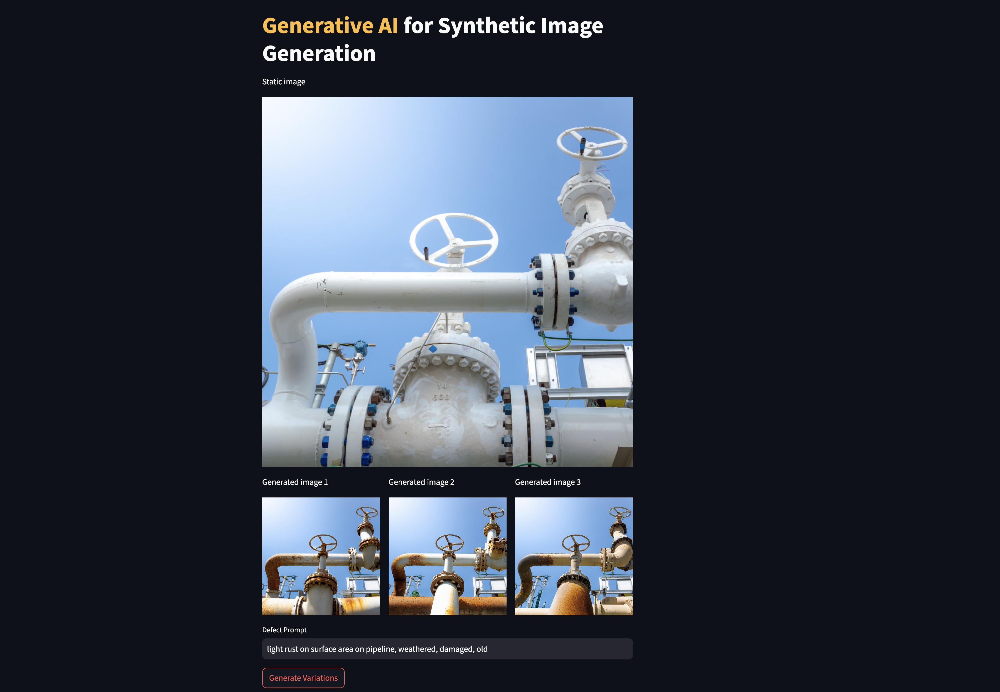
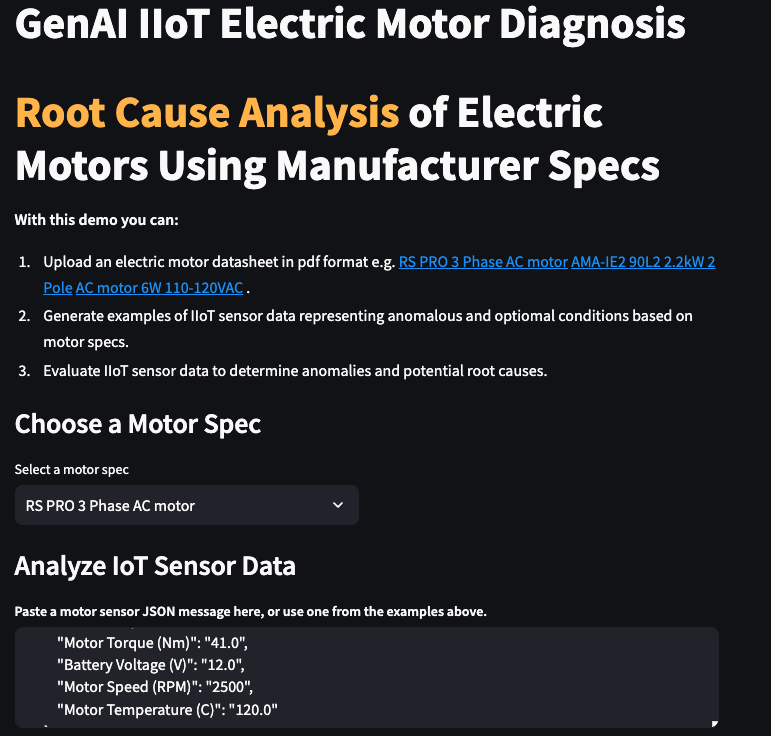
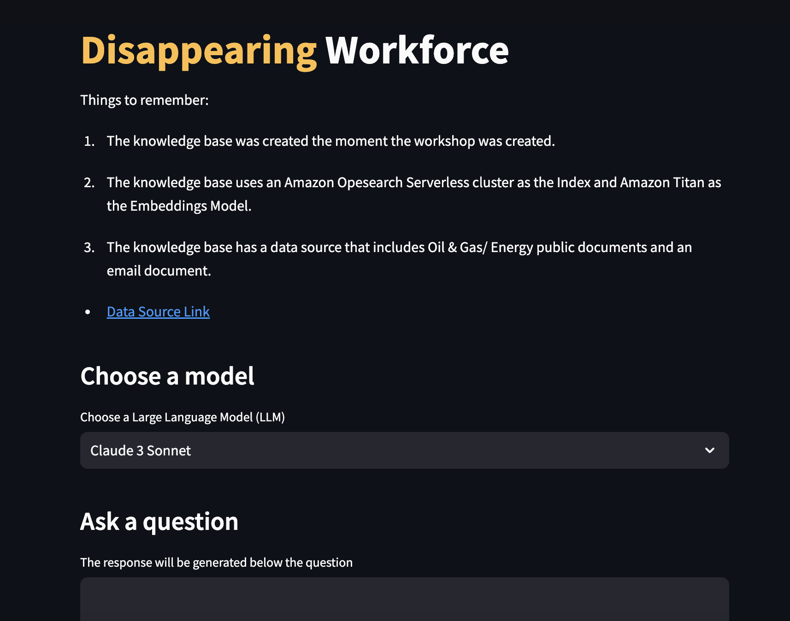
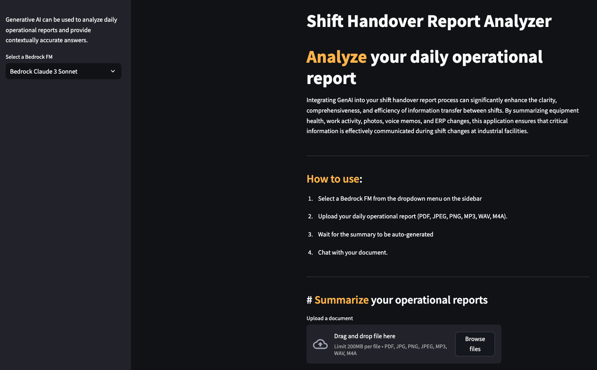
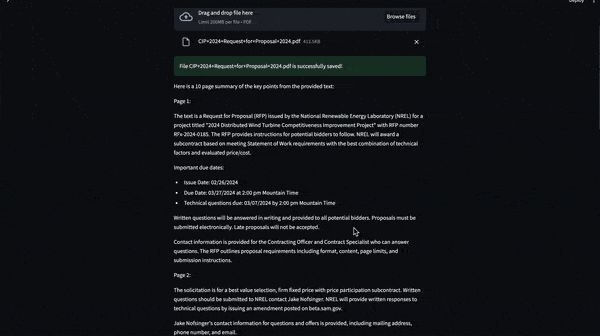

# Generative AI Energy - Power & Utilities Industry Examples

This repository contains a set of example projects for the [Amazon Bedrock](https://aws.amazon.com/bedrock) for energy and power & utilities industry.

## Table of Contents
1. [About this Repo](#About)
2. [Examples](#Examples)
3. [Setup your Account](#Setup)
4. [Learning Resources](#Learning)
5. [License](#License)

## About this Repo 

This repo is intended for customers in energy and power & utilities industry who are interested to understand Generative AI LLM models, text-to-image model like Stable diffusion and a Retrieval Augmented Generation (RAG) architecture to index, search and return relevant information.

The repo is subdivided into sections for each use case (see ["Examples"](#Examples)). These examples show how to leverage Amazon Bedrock models to address business challenges, optimise internal processes, and realise efficiency advantages.

We welcome contributions to this repo in the form of fixes to existing examples or addition of new examples. For more information on contributing, please see the [CONTRIBUTING](/CONTRIBUTING.md) guide.

|  |  | |
| :---: | :---: | :---: |
|  |  |

## Examples 

In this repo, we’ll learn generative artificial intelligence(AI) use cases specific to energy and power & utilities industry. The repo comprises set of use cases that will help you learn how to use LLM AI models to generate unique and compelling content.

This repo includes following use cases:
1. [Predictive Maintenance](/predictive-maintenance/): Creating synthetic images of equipment with rust or water damage could help in the accuracy of predictive maintenance models
2. [Root Cause Analysis of Equipments](/root-cause-analysis/): Incorporating Generative AI into your RCA process, you can make the analysis more adaptive, context-aware, and capable of reasoning, pattern recognition and dynamic learning
3. [Analyzing Shift Handover Reports](/shift-handover-report/): Leveraging Generative AI through conversational chat to extract insights from operational shift handover reports in different formats.
4. [Analyzing RFP Documents](/rfp-documents/): Process and summarize the key details from RFP documents
5. [Disappearing Workforce](/disappearing-workforce/): Capture valuable knowledge from interviews with employees using generated questions; collect emails, reports, and presentations can be analyzed and easily queried and accessed when needed

### Setup your Account 
This repo assumes you have access to Amazon Bedrock in the AWS Console, and that you have a profile you can use to access Bedrock programmatically.

In the AWS console, select the region from which you want to access Amazon Bedrock.
At the time of writing, this repo will work best in either the us-west-2 (Oregon) or us-east-1 (N. Virginia) regions.

Please proceed to the next step:
- [Amazon Bedrock setup](/own-aws-account/bedrock-setup.md)
- [AWS Cloud9 setup](/own-aws-account/cloud9-setup.md)
- [Lab setup](/own-aws-account/lab-setup.md)
- [Minimum IAM permissions (for system admins)](/own-aws-account/permission-setup.md)

### Official Resources 
- [Amazon Bedrock service page](https://aws.amazon.com/bedrock/) 
- [Amazon Bedrock User Guide](https://docs.aws.amazon.com/bedrock/latest/userguide/) 
- [Amazon Bedrock API Reference](https://docs.aws.amazon.com/bedrock/latest/APIReference/) 
- [Generative AI Energy - Power & Utilities Industry Workshop](https://catalog.us-east-1.prod.workshops.aws/workshops/4db05a4c-f22f-4d24-8800-932626a8c197/en-US) 

Model provider-specific documentation:
- [AI21 documentation](https://docs.ai21.com/docs/overview)
- [Amazon Titan documentation](https://docs.aws.amazon.com/bedrock/latest/userguide/titan-models.html) 
- [Anthropic documentation](https://docs.anthropic.com/claude/docs) 
- [Cohere documentation](https://docs.cohere.com/docs/the-cohere-platform) 
- [Stability AI documentation](https://platform.stability.ai/docs/features) 
- [Whisper Documentation](https://github.com/openai/whisper)

# License 

This library is licensed under the MIT-0 License. See the [LICENSE](/LICENSE) file.
